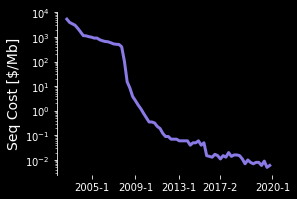

# Plotting the progress of single cell genomics

Single cell genomics studies have rapidly grown in scale while simultaneously falling in cost.
Alongside the plunging cost of DNA sequencing, library preparation reagents have likewise become cheaper and cheaper.

Here, we gather data on the scale of single cell studies (`cells per study`), the cost of genome sequencing (`$ per Mb`), and the cost of library preparations (`$ per cell`) to generate visualizations.

## Usage

```
git clone sc_studies
cd ./sc_studies
make
```

## Data

1. Data on the scale of single cell studies is sourced from [Valentine Svensson's excellent database.](https://www.nxn.se/single-cell-studies)
2. DNA sequencing cost data is sourced from [the NIH.](https://www.genome.gov/about-genomics/fact-sheets/DNA-Sequencing-Costs-Data)
3. Single cell library construction costs come from a variety of sources. I computed the cost per cell using my best judgement given available figures. 

## Results


